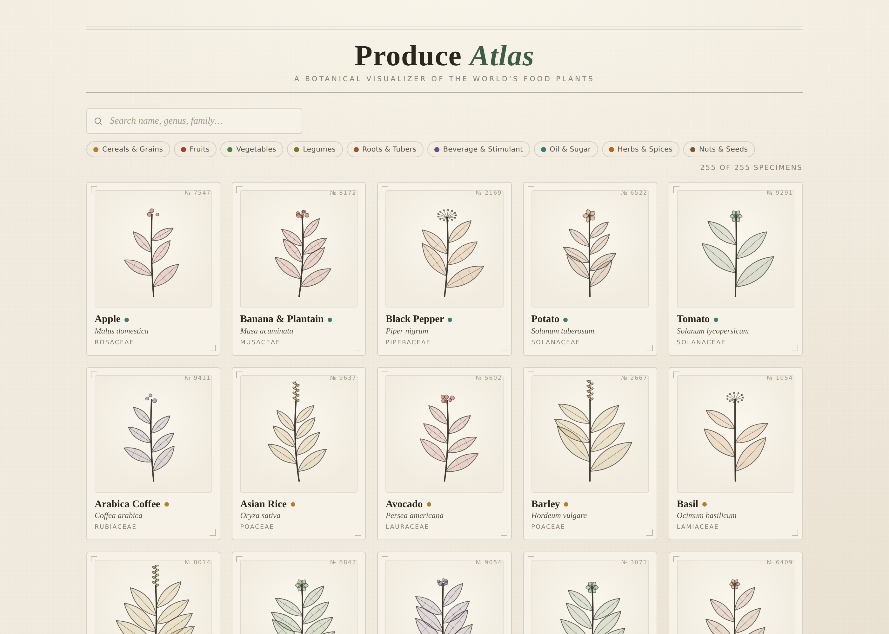

# Produce Atlas

A botanical visualizer of the world's food plants — a herbarium-style field
guide tracing each species' scientific identity, origin, domestication, and
historical spread.



## What it is

Produce Atlas is a **botanical field guide**. Every species is drawn as a
**generative botanical plate** — a unique, deterministic ink-line plant (stem,
leaves, and a category-appropriate inflorescence) rendered on warm parchment.
Browse the specimen gallery, then open a **specimen sheet**: the plate and a
herbarium label beside a dossier with scientific identity, wild progenitor,
domestication, an **antique flat origins map** (centre of origin + dispersal
arcs), evidence, and — for flagship crops — a source-linked claim packet.

The dataset follows the Vavilov centers-of-origin framework as refined by modern
archaeobotany and genetics. Dates are approximate years before present (BP);
dispersal legs summarise well-attested movements rather than every route.

## Features

- **Generative botanical plates** — each species (`src/plant.ts`) grows a
  deterministic ink-line plant with a category-specific inflorescence (grass
  ear, umbel, composite disc, blossom, berry cluster, pod, or catkin). No image
  assets; scales to thousands; lazily drawn as cards scroll into view.
- **Herbarium field-guide UI** — warm parchment, botanical serif, specimen
  gallery with accession numbers, and a specimen-sheet modal.
- **Antique origins map** (`src/atlasmap.ts`) — a quiet equirectangular ink-on-
  parchment plate (from Natural Earth coastlines) showing each authored crop's
  centre of origin and dispersal arcs. Replaces the old 3-D globe.
- **Two-tier catalog** — a curated **atlas** of 51 fully-authored crops (with
  origins, spread, and dossiers) plus a **baseline scientific index** of ~200
  more real edible species (identity + family + plate, honestly labeled, no
  invented origins). ~255 total across nine categories including nuts & seeds.
- **Evidence-governance layer** — every record labeled by research **maturity**
  (flagship / authored / baseline); the five flagship crops carry formal
  **claim packets** of source-linked statements with per-claim confidence and
  review status, backed by a shared source registry. An **About & methodology**
  panel makes the limits visible. Every crop carries a **safety note**. See
  [METHODOLOGY.md](METHODOLOGY.md).
- **Filtering** — live search (name, genus, family) and category chips (click a
  category to isolate it).
- **No runtime dependencies** — pure TypeScript + Canvas + SVG. ~584 kB bundle
  (mostly the vendored coastline data), no CDN or network calls.
- **Tested & CI-enforced** — a `vitest` data-integrity suite; GitHub Actions
  runs typecheck, tests, and both builds on every push.
- **Accessible** and keyboard-navigable; respects `prefers-reduced-motion`.

## Tech stack

- [Vite](https://vitejs.dev/) + TypeScript (no framework — hand-rolled DOM)
- **No runtime dependencies** — botanical plates via Canvas 2D, the origins map
  via inline SVG. Coastline data is vendored and inlined, so there is **no CDN
  or network call**.

## Getting started

```bash
npm install     # install dependencies
npm run dev     # start the dev server (http://localhost:5173)
npm test        # run the data-integrity test suite (vitest)
npm run build   # typecheck + production build to dist/
npm run preview # serve the production build locally

# Single, fully self-contained build (all JS/CSS/data inlined, no requests):
npx vite build --config vite.config.artifact.ts   # -> dist-artifact/index.html
```

## Project structure

```
index.html              App shell + botanical boot screen
src/
  main.ts               State + orchestration (gallery, sheet, filters)
  ui.ts                 Herbarium chrome, specimen gallery, specimen sheet
  plant.ts              Generative botanical plate generator (Canvas 2D)
  atlasmap.ts           Antique equirectangular origins map (inline SVG)
  data/
    crops.ts            Curated atlas dossiers (+ maturity, safety, claims)
    speciesIndex.ts     Baseline scientific index (real species, honestly labeled)
    species.generated.ts  Importer output slot (empty until an import runs)
    categories.ts       Category metadata + botanical palette
    sources.ts          Shared source registry + maturity metadata
    countries.json      Natural Earth coastlines (bundled at build time)
    data.test.ts        Schema + maturity-summary integrity tests
  types.ts              Data model (crop, claim, source, maturity, index, safety)
  styles.css            Botanical field-guide design system
scripts/import-species.mjs  CSV → baseline index (path to the full Kew list)
.github/workflows/ci.yml    Typecheck · test · build · artifact build
```

## Scaling the index

The baseline index is designed to grow to the full Kew *World Checklist of
Useful Plants* (~7,039 human-food species). Drop a CSV in and run the importer;
every row becomes a baseline record with its own botanical plate — no
hand-authoring, no invented origins:

```bash
node scripts/import-species.mjs path/to/species.csv --category vegetable
# writes src/data/species.generated.ts, which the app merges into the index
```

## Data & accuracy

Origin centers and dates reflect current mainstream scholarship but are
inherently approximate and, for several crops, actively debated. The atlas
deliberately distinguishes **structural completeness** from **research depth**:
of 21 records, 5 are flagship (source-linked claim packets, all with review
still pending — **0 expert approvals**) and 16 are individually authored. Treat
the atlas as an illustrative, evidence-led overview, not a primary source or a
specialist-reviewed encyclopedia. See [METHODOLOGY.md](METHODOLOGY.md) for the
full governance model.
