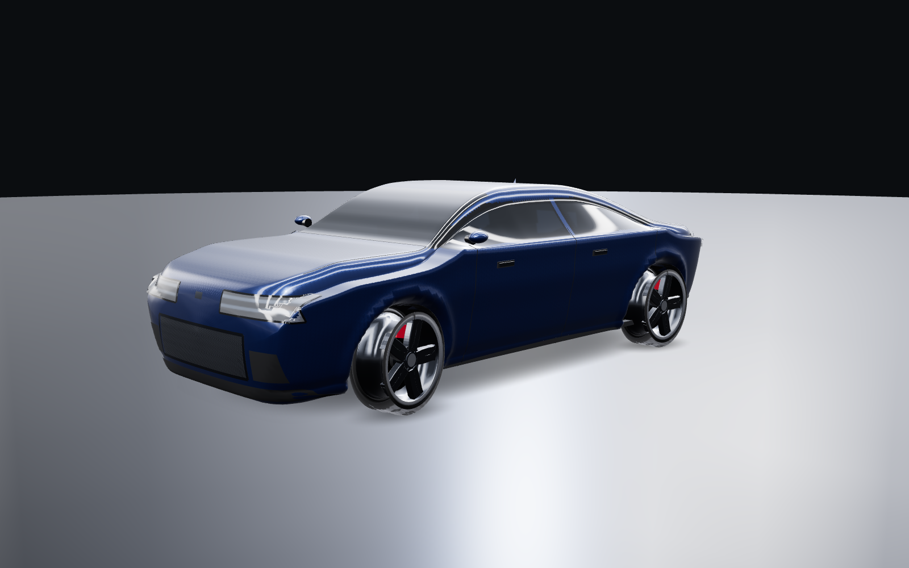

# car3d

A procedurally generated car for three.js. No `.gltf`, no textures on disk, no CDN
assets — the body surface, the wheels, the tyre tread, the metallic-flake paint and
the studio light probe used for reflections are all computed from maths at runtime.
One file, one `npm i three`.



```bash
npm i three     # r160+; developed and verified against r185
```

```js
import * as THREE from 'three';
import { createCar, createStudioEnvironment } from './car3d.js';

const env = createStudioEnvironment(renderer);   // do this once
scene.environment = env.envMap;

const car = createCar({ bodyColor: '#16305c' });
scene.add(car.group);

// in your animation loop
car.update(dt, speedInMetresPerSecond);
```

Open `demo.html` in a browser for a runnable version with orbit controls and a
colour picker. `CarModel.jsx` is a React Three Fiber wrapper.

## Orientation and scale

Real-world metres, built around the origin: **+X right, +Y up, +Z forward** (the
nose points at +Z), wheels resting on the `y = 0` plane. The default car is
4.75 m long, 1.92 m wide, 1.40 m tall on a 2.87 m wheelbase.

## API

```js
const car = createCar(options);
```

| option | default | meaning |
| --- | --- | --- |
| `preset` | `'gt'` | `'gt'` \| `'suv'` \| `'hatch'` — see the note below |
| `bodyColor` | `'#16305c'` | anything `THREE.Color` accepts |
| `quality` | `'high'` | `'low'` \| `'medium'` \| `'high'` (≈40k / 65k / 99k triangles) |
| `glass` | `'transmission'` | `'simple'` is cheaper and safe on weak GPUs |
| `rimStyle` | `'split5'` | `'split5'` \| `'mesh'` |
| `rimColor`, `caliperColor`, `glassTint` | | |
| `paintMetalness`, `paintRoughness`, `flakes` | `0.72`, `0.30`, `1.0` | metallic-flake paint controls |
| `envMapIntensity` | `1.25` | |
| `interior`, `details`, `panelLines`, `contactShadow`, `castShadow` | `true` | |
| `spec` | | override any individual profile — see *Designing another car* |

Returned object:

```js
car.group                  // THREE.Group — add this to your scene
car.update(dt, speed)      // speed in m/s; spins the wheels
car.setSteering(radians)   // Ackermann-corrected, ±0.62 rad
car.setPaintColor(color)
car.setLights(bool)        // headlamps + running lights
car.setBrake(0..1)
car.setReverse(bool)
car.setIndicator(-1|0|1)   // drive from a timer to blink
car.dispose()              // geometries, materials and textures
car.spec, car.surface, car.materials, car.wheels, car.body   // escape hatches
```

`createStudioScene(renderer, options)` is a convenience that returns a lit scene
with a reflective floor, ready to drop a car into.

## How it is built

The body is **one continuous lofted surface**. At each station along Z a
cross-section is assembled from six named stretches — flat floor, bottom fillet,
lower flank (carrying the character line), greenhouse taper, roof fillet, flat
roof — each given a fixed slice of the section parameter `q`. Because the slices
are fixed, `q = 0.47` means "the shoulder line" at every station, so features run
along the car exactly where a designer would draw them.

That decoupling is the whole trick. A single super-ellipse cannot make a flat
roof and flat sides at the same time: square it up enough for a roof and the
flanks go razor-edged; round the flanks and the roof inflates into a bubble
canopy. Splitting the section fixes both, and hands everything downstream a
meaningful coordinate to attach to:

- **Glass** is classified in section coordinates rather than from surface
  normals. The greenhouse stretch *is* the side glass, clipped by a
  daylight-opening polygon drawn in the side view; the flat-roof stretch *is*
  the windscreen inside its Z band. A-pillars, roof rails and the B-pillar fall
  out for free as the paint left over at the edges.
- **Wheel arches** are carved by dishing the flanks inside a circle centred on
  each hub, and the dished triangles are re-materialled as the inner arch.
- **Lamps, grille, splitter, diffuser and badges** are projected onto the body:
  a rectangle in the head-on view is marched inward along Z until it crosses the
  section outline. Nothing is positioned by eye, so retuning a profile moves the
  details with it.
- **Panel gaps** are ribbons swept along paths in `(station, q)` space.

Reflections come from a floating-point equirectangular probe built in code —
overhead strip lights, a key softbox, fill, and a horizon. The long specular
streaks those strips throw down the flanks are most of what makes a car render
read as a car.

## Designing another car

Every silhouette lives in the `PRESETS` table as profile curves sampled along Z.
Nothing else in the file needs to change. Read `top` as the side-view roofline,
`width_` as the plan view, `belt` as the shoulder line, `taperTop` as
tumblehome. Interpolation is monotone cubic, so the curves cannot overshoot —
an overshoot of two millimetres on a car body reads instantly as a dent.

```js
import { PRESETS, createCar } from './car3d.js';

const car = createCar({
  spec: { ...PRESETS.gt, width: 2.02, taperTop: [[-2.375, 0.14], /* … */] },
});
```

**On the presets:** `gt` is the one that has been iterated on and rendered from
every angle. `suv` and `hatch` build cleanly and are correct structurally —
glass, pillars and details all land where they should — but their proportions
have not had the same tuning pass and currently read closer to a van than to a
crossover or a hot hatch. Treat them as worked examples of the profile format
rather than finished bodies.

## Performance

At `quality: 'high'` the car is ~99k triangles across ~215 meshes and builds in
roughly 350 ms. Build once and reuse; `createCar` is not something to call per
frame. On weak GPUs pass `glass: 'simple'` — `transmission` costs an extra scene
render pass.

Renderer settings that matter:

```js
renderer.toneMapping = THREE.ACESFilmicToneMapping;
renderer.outputColorSpace = THREE.SRGBColorSpace;
renderer.shadowMap.enabled = true;
renderer.shadowMap.type = THREE.PCFSoftShadowMap;
```

## Licence

MIT.
