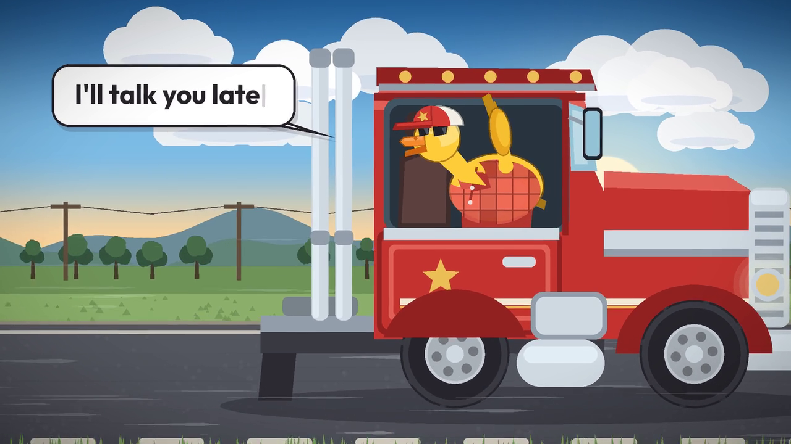

# Trucker Duck

A 9-second animated short: a duck sprints down a highway, spins into a flash of
light, and comes out the other side as a trucker duck who leans out of his rig
and says **"I'll talk you later"** before pulling away.



Output: `out/trucker-duck.mp4` — 1280x720, 30 fps, H.264 + AAC.

## How it is made

This is *not* a diffusion/text-to-video model. Every frame is drawn
procedurally with Pillow and every sound is synthesised with numpy — so the
short is fully deterministic and reproducible from source.

- **`make_duck_video.py`** — the animation. Vector shapes are drawn into a
  1280x720 logical coordinate space at 2x supersampling and downsampled with
  Lanczos for anti-aliasing. The duck is a rigged puppet: the legs are posed by
  a two-bone IK solver driven by a stride-cycle foot path, and the body, head,
  wings and tail hang off a leaning torso transform. Parallax backgrounds are
  pre-rendered as seamlessly tiling strips and scrolled per layer.

### How the motion is driven

Every channel is integrated once up front at eight sub-steps per frame
(`build_motion`) rather than evaluated as a per-frame formula, which is what
lets the rig behave like a puppet with weight instead of a set of sine waves.

- **The feet are locked to the road.** Stride phase is taken directly from the
  distance the world has scrolled, so during stance a foot travels backward at
  exactly the ground speed and never skates. That constrains the design rather
  than the reverse: a planted foot can only reach `2 * sqrt(reach^2 - hip^2)`
  from the hip, so the legs are built long enough for the stride the ground
  speed demands — there is an assertion at the top of the rig section that fails
  the render if the two ever drift out of agreement.
- **Body height comes from an impact curve**, not a bob. Weight drops fast over
  the first quarter of each half-stride and floats back up on push-off. Squash
  and stretch are then read off the *second derivative* of that curve, so he
  compresses when he lands and elongates when he leaves the ground.
- **Overlapping action** comes from damped springs chasing the body height at
  different frequencies — head, tail and cap each arrive a few frames late, and
  the wing's feather fan trails its own arm.
- **The beak is keyed to the audio.** `duck_audio.LINE_SYLLABLES` is the single
  source of truth for the spoken line: the synthesiser reads its formants and
  the animation reads its mouth shapes and stress, so the jaw opens on the
  syllable that is actually sounding and the head nods on the stressed ones.
- **The camera is a real camera.** The frame is rendered with a few percent of
  overscan so a struck-and-ringing shake has somewhere to move; it is kicked on
  the launch, the blast, the landing, the air brake and the horn, rides the
  duck's footfalls during the sprint, and pushes in slightly while he talks.
- The rig sits on springs too: the wheels stay planted on the ground line while
  the body rides its own travel, so the cab dives under braking and squats when
  it pulls away — and the duck in the window jiggles a beat behind it.
- **`duck_audio.py`** — the soundtrack. Footsteps, wind, the transformation
  whoosh, a chugging diesel idle and a two-tone air horn are built from
  filtered noise and oscillators. The closing line is spoken by a formant
  synthesiser: a glottal pulse train with a pitch contour, shaped by
  three two-pole resonators per syllable tracking the vowel targets of
  "I'll / talk / you / la / ter", with a ring-modulated rasp for the duck
  timbre.

## Beat sheet

| time | beat |
|------|------|
| 0.00–3.55s | flat-out sprint, dust, leg smears, rushing parallax |
| 3.55–3.78s | anticipation: he gathers into a crouch |
| 3.78–4.40s | launch, spin into a blur, a held beat at the apex |
| 4.40–4.76s | white blast |
| 4.76–4.99s | he drops in braced |
| 4.99–5.46s | lands hard, squashes, settles; the rig rolls in over him |
| 5.46–8.00s | he waves out the window and delivers the line |
| 8.00–9.00s | air horn, and the rig accelerates away |

## Running it

```bash
pip install pillow numpy imageio-ffmpeg
python3 make_duck_video.py                    # -> out/trucker-duck.mp4
python3 make_duck_video.py stills 90 120 205  # dump single frames to inspect
```

`imageio-ffmpeg` supplies a bundled ffmpeg binary; a system `ffmpeg` on `PATH`
works too. Text uses Outfit Bold if present and falls back to DejaVu Sans Bold,
so no font files are vendored here.

Timing, staging and palette all live in named constants at the top of
`make_duck_video.py` — change `T_*` to re-cut the beats, or `LINE` to change
what he says.
